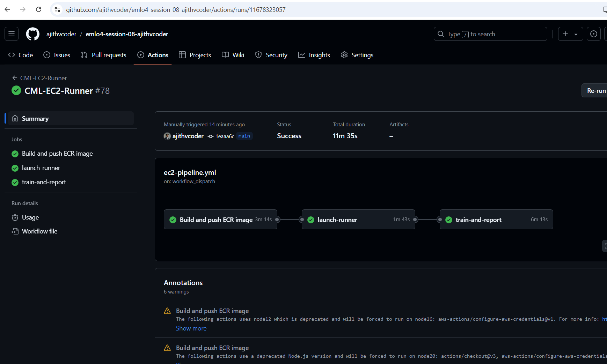
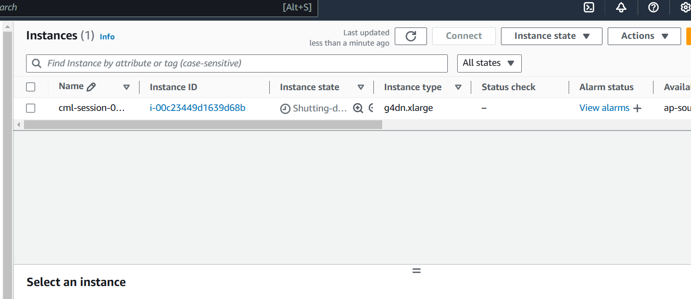
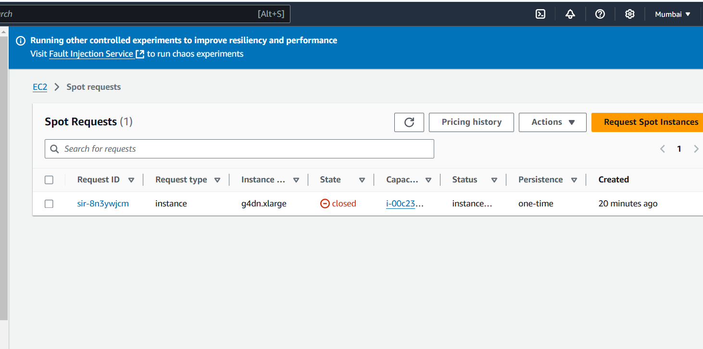
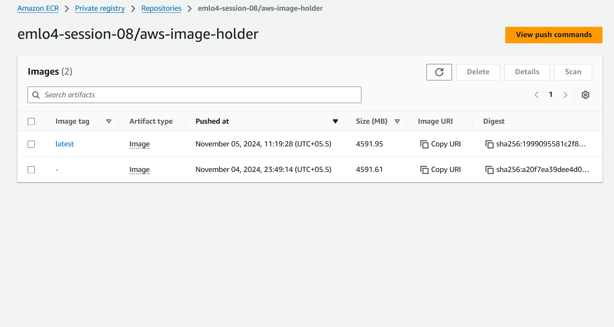
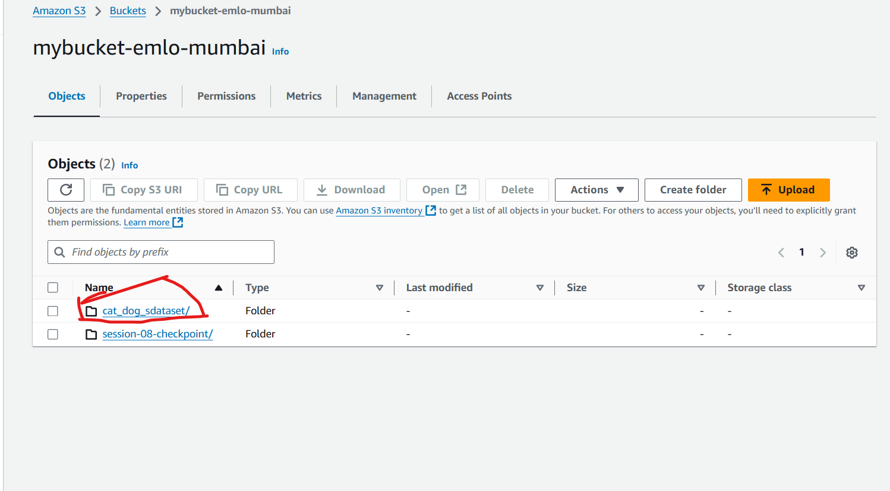
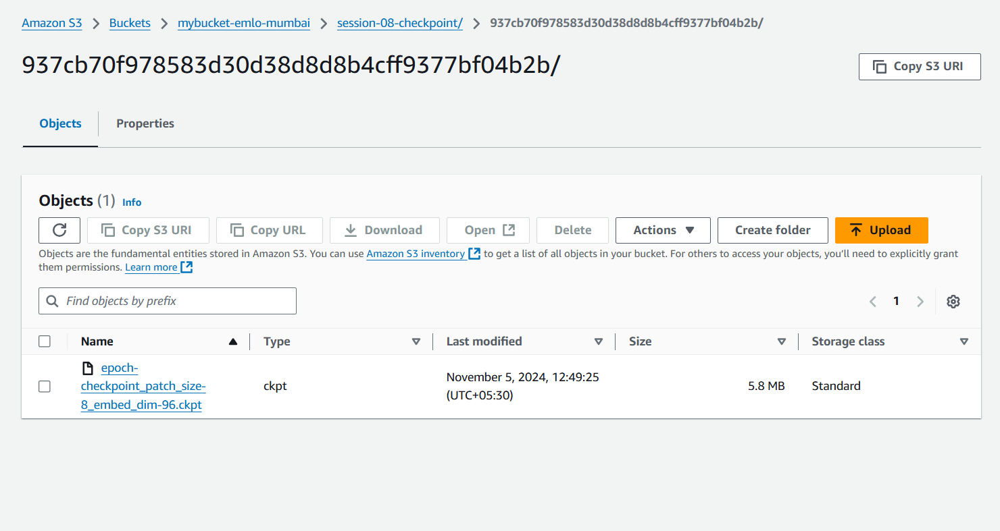
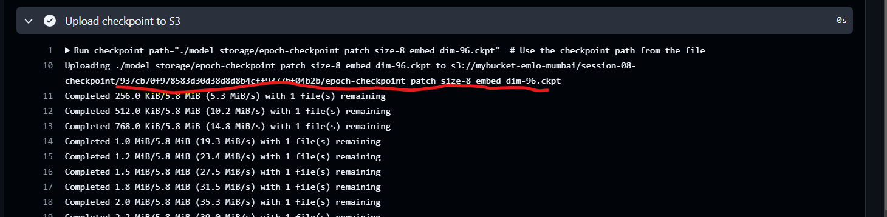

## EMLOV4-Session-10 Assignment - (Under development)

https://drive.google.com/file/d/1V4awkaDGr8s1aI3VGoQUs1Ao6aF8_Os3/view?usp=sharing


docker build -t light_train_test -f ./Dockerfile .

docker run --gpus=all -d -v /home/ubuntu/devc/emlo4-session-10-ajithvcoder:/workspace/ light_train_test

docker exec -it <c511d4e6ed1a9ca6933c67f02632a2> /bin/bash

Order in which tests are run (eval should run after train)

Packages like pytest-order and pytest-dependency are used for readability and ordering
Command: pytest --collect-only -v
Overall Test Coverage Command

pytest --cov-report term --cov=src/ tests/
Individual Module Test Command

pytest --cov-report term --cov=src/models/ tests/models/test_classifier.py
pytest --cov-report term --cov=src/data_modules/ tests/models/test_datamodules.py  

### Contents

- [Requirements](#requirements)
- [Development Method](#development-method)
    - [DVC Integration with AWS S3](#dvc-integration-with-aws-s3)
    - [Run AWS works manually for testing](#run-aws-works-manually-for-testing)
    - [Building ECR image for development](#building-ecr-image-for-development)
    - [Using CML to trigger EC2 spot instance](#using-cml-to-trigger-ec2-spot-instance)
- [Learnings](#learnings)
- [Results Screenshots](#results-screenshots)

### Requirements

- Build the Docker Image and push to ECR
    - You’ll be using this ECR image for training the model on AWS GPU
    - Make sure you use GPU version of PyTorch
- Connect DVC to use S3 remote
- Train model on EC2 g4dn.xlarge
- Test the model accuracy
- Push the trained model to s3
    - use specific folder and commit id

### Development Method

#### Build Command

**GPU Usage**

- Pass cuda parameter to trainer so that i trains with GPU
- You need to pass `--gpus=all` to docker run command so that it uses host GPU

**Debug Commands for development**

- Since GPU is used training is faster at inital stage you may commit the dataset also with docker file so that you can debug the workflow faster and run `dvc repro -f` command to verify the pipeline. Even for 70 MB it takes 3 minutes so if you use this method you can debug work for cml triggering EC2 spot instance faster. 
- Also i noted that GPU allocated when instance triggered through CML is T4 cuda 11.4 instance. But when I trigger manually throguh AWS UI I am getting T4 cuda 12.1 instance. Only few packages had a facility to launch with ami-id.
- Developed with `uv package` and `--system` in docker.


**Hparam Search Train Test Infer Commands**

**Install**

```export UV_EXTRA_INDEX_URL: https://download.pytorch.org/whl/cpu```

OR 

```uv sync --extra-index-url https://download.pytorch.org/whl/cpu ```

if you are going by `--extra-index-url` method you might need to give it every time when u use `uv` command


**Pull data from cloud**

```dvc pull -r myremote```

**Trigger workflow**

```dvc repro```


### DVC Integration with AWS S3

- Set environment variables in docker container and set the S3 bucket path

    ```
    export AWS_ACCESS_KEY_ID='myid'
    export AWS_SECRET_ACCESS_KEY='mysecret'
    dvc remote add -d myremote s3://<bucket>/<key>
    ```

**Reference**

- [Github Blog](https://github.com/ajithvcoder/dvc-gdrive-workflow-setup)
- [Medium blog](https://medium.com/@ajithkumarv/setting-up-a-workflow-with-dvc-google-drive-and-github-actions-f3775de4bf63)

**Add Train(Hparam search), test, infer, report_generation stages**

- `uv run dvc stage add -f -n train -d configs/experiment/catdog_ex.yaml -d src/train.py -d data/cats_and_dogs_filtered python src/train.py --multirun --config-name=train experiment=catdog_ex trainer.max_epochs=3`

- `uv run dvc stage add -n report_genration python scripts/multirun_metrics_fetch.py`

- `uv run dvc stage add -f -n test -d configs/experiment/catdog_ex.yaml -d src/eval.py  python src/eval.py --config-name=eval experiment=catdog_ex`

- `uv run dvc stage add -f -n infer -d configs/experiment/catdog_ex.yaml -d src/infer.py python src/infer.py --config-name=infer experiment=catdog_ex` 


- You would have generated a `dvc.yaml` file, `data.dvc` file and `dvc.lock` file push all these to github

- Note: You can still add more dependecies and output in dvc.yaml file to improve the quality and relaiablity


### Github Actions Pipeline

- setup cml, uv packages using github actions and install `python=3.11.7`
- Create AWS User keys and copy the contents of `AWS_ACCESS_KEY_ID`, `AWS_SECRET_ACCESS_KEY` and store in github reprository secrets with variable name `AWS_ACCESS_KEY_ID`, `AWS_SECRET_ACCESS_KEY`.

### Multirun personalization and report generation

**In multirun scenario we can't give a generic checkpoint name for eval.py and infer.py**

- In the `train.py` there is a class `CustomModelCheckpiont` which is used in `config/callbacks/model_checkpoint.yaml` is used to save the checkpoint file name with hparam config. example in this repo i have used `patch_size` and `embed_dim` for hyper param search so every checkpoint is stored with these contents as a filename. it could also be made more generic by using a for loop to fetch hyperparams and form a checkpoint file or giving a `uuid` for each runs final checkpoint.

- After `train.py` is completed `scripts/multirun_metrics_fetch.py` is ran and it collects hyper params and its corresponding val_acc, val_loss, test_acc, test_loss and forms table and plots. At last it takes `optimization_results.yaml` and fetches the best hyperparameters and saves the checkpoint file name to `best_model_checkpoint.txt`

- This `best_model_checkpoint.txt` is already stored in configs of eval and infer and its parsed and used when those configs are triggered

**Model Classifier**

- You can use `**kwargs` and import necessary configs related to `convnext` . Also you can feed the model necessary configs to it.

**Train-Test-Infer**

**Debugging and development**

Use a subset of train and test set for faster debugging and development. Also u can reduce the configs of model to generate a `custom 7.5k param convnext model`. I have reduced from 27 million params to 7.3k params by using the config. 

**Overall Run**
- `dvc repro`

**Train**
- `dvc repro train`

**Report**
- `dvc repro report_generation`

**Test**
- `dvc repro test`

**Infer**
- `dvc repro infer`

**Copy best checkpoint and Move to S3**

- `python scripts/multirun_metrics_fetch.py` will fetch the necessary files needed for report and log table and plots to report.md. Moreover it also creates a file `best_model_checkpoint.txt` which holds the **optimized configs checkpoint model**
- From `best_model_checkpoint.txt` use the file name in it and move to S3 using terminal commands in github actions

### Run AWS works manually for testing

Do all these things manually first to understand the flow 
- Connect vscode to ec2 instance 
- Create a ECR repo and try to push there from ec2
- Try pulling the image and see
- Next check the image locally and do improvements in ec2 itself. 
- After you are sure it can run dvc repro command then push and test in ecr + github actions

Do these manually
- Use s3 for storing datas
- Do pushing checkpoint to s3
- Then go with github actions
- TODO - Blogs to write
    - integrate S3
    - github actions to start a spot g4dnx instance


### Learnings

- Make sure in **Spot Requests** everything is turned off because with some settings ttl of 35 days + some other setting it was not turning off and restarting the ec2 instance even if i turn off manually.

- Pass proper parameter to `cml runner launch` else it may not close automaicall or restart even if you turn off

    ex: `cml runner launch \
            --cloud=aws \
            --name=session-08 \
            --cloud-region=ap-south-1 \
            --cloud-type=g4dn.xlarge \
            --cloud-hdd-size=64 \
            --cloud-spot \
            --single \
            --labels=cml-gpu \
            --idle-timeout=100 `

- Error caused due to "dvc is not available in /workspace" is due to -v $(pwd):/workspace/ 

- Dont use model_storage:/workspace/model_storage like this, it corresponds to model_storage docker volume not as a folder

### Building ECR image for development

**Refer workflow/ec2-pipeline.yml**

**build-and-push-ecr-image**

- Checkout Code 
- Install Jq for supporting aws related actions
- Use `aws-actions/configure-aws-credentials@v1` for credentials configuration
- Use `aws-actions/amazon-ecr-login@v1` for logging in
- Get the latest commit id and store it as environment variable
- Use `docker-build` and `docker-push` to build and push in github actions

### Using CML to trigger EC2 spot instance

**Refer workflow/ec2-pipeline.yml**
- Use `iterative/setup-cml@v2` to launch cml runner
- Using `cml runner launch` chose the type of instance you need eg: g4dn.xlarge and sub type `spot` and it will trigger it in EC2. Make sure your role permissions are clear for the ACCESS_TOKEN user you used. Else you might face a error there. A normal spot instance is triggered with 4 CPUs by default.

- Verify if its a spot instance using api `http://169.254.169.254/latest/api/token`.
- Check the GPU present there only then you can use respective image. Example when i triggered manually i was getting T4 with cuda 12.1 but in cml launcher i was getting T4 with cuda 11.4 driver. So if you use a advanced image like 12.1 on 11.4 it wont be supported. However 11.8 is supported on 11.4 cuda.

- From best_checkpoint.txt file your can get the best checkpoint file name and it being transfered from model_storage folder to `mybucket-emlo-mumbai/session-08-checkpoint` in S3 by having a folder named with commit id in it.

**Reference**

-  [cml-example-cloud-gpu](https://github.com/iterative-test/cml-example-cloud-gpu),[cml-advanced-setup](https://github.com/iterative/cml#advanced-setup) - Was able use this and trigger ec2 start and stop tasks. Not sure how to specify AMI id to it.

- [ec2-github-runner](https://github.com/machulav/ec2-github-runner) - Not able to specify spot instance 

- [deploy-self-hosted-runners-to-ec2-spot-on-demand](https://github.com/marketplace/actions/deploy-self-hosted-runners-to-ec2-spot-on-demand) - keeps on polling not sure which setting should be used to stop polling


### Results Screenshots


**Auto Github ECR push, CML to trigger EC2 spot, DVC Repro run**

Run details - [here](https://github.com/ajithvcoder/emlo4-session-08-ajithvcoder/actions/runs/11678323057)



**Auto turning off of EC2 instance and spot request**






**ECR Repo**



**DVC integration with S3**



**Check point Storage in S3**






Note: The objective is to complete the requirements of assignment with minimal resource so i have reduced dataset and the optuna trail runs and model size for faster integration

### Group Members

1. Ajith Kumar V (myself)
2. Pravin Sagar
3. Pratyush
