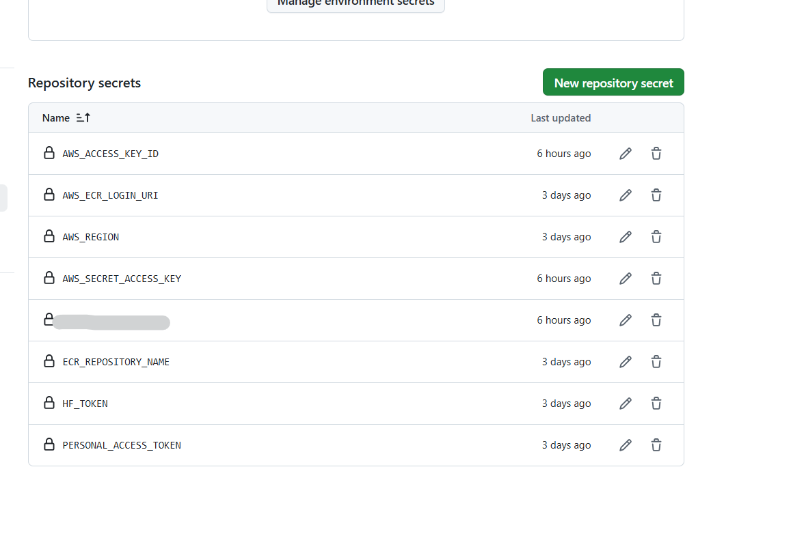

## EMLOV4-Session-10 Assignment - Deployment w/ Gradio  (Auto Github ECR push, CML to trigger EC2 spot, DVC Repro S3 storage using github actions, Deploy using Gradio to hugging face spaces)

**Abstract: Once github workflow is triggered it develops a docker image with github code content and pushes the image to ECR after it cml is used to trigger EC2 instance and docker image is fetched inside EC2 and used for training, evaluation, inferencing and checkpoint is stored in AWS S3 storage. Best model is pushed to HuggingFace spaces using gradio for deployment. Also both EC2 instance and spot request are turned off after run**

### Contents

- [Requirements](#requirements)
- [Development Method](#development-method)
    - [Refer-session-08-readme](#refer-session-08-readme)
    - [Multirun personalization](#multirun-personalization-and-report-generation)
    - [Run AWS works manually for testing](#run-aws-works-manually-for-testing)
    - [Github Actions Pipeline](#github-actions-pipeline)
    - [Building ECR image for development](#building-ecr-image-for-development)
    - [Using CML to trigger EC2 spot instance](#using-cml-to-trigger-ec2-spot-instance)
    - [Gradio Deployment](#gradio-deployment)
- [Learnings](#learnings)
- [Results Screenshots](#results-screenshots)

### Requirements

CI/CD to Deploy the Cat-Dog/ Dog-Breed Classifier as Gradio App to Huggingface Spaces

- Create a python script to trace/script the trained model and save it
- Create a Gradio app to serve the cat
- Deploy the app to Huggingface Spaces
- Add tracing and deployment step to github actions. 
    - This will complete the entire CI/CD pipeline from testing code, creating docker image, training the model, evaluating the model to deploying the model

### Development Method

### Build Command

**GPU Usage**

- Pass cuda parameter to trainer so that i trains with GPU
- You need to pass `--gpus=all` to docker run command so that it uses host GPU

**Debug Commands for development**

*Docker Commands*

- `docker build -t light_train_test -f ./Dockerfile .`

- `docker run -d --gpus=all -d -v /home/ubuntu/devc/emlo4-session-10-ajithvcoder:/workspace/ light_train_test`

- `docker exec -it <c511d4e6ed1a9ca6933c67f02632a2> /bin/bash`

*Pytest commands*

- `pytest --cov-report term --cov=src/ tests/`

Individual Module Test Sample Command

- `pytest --cov-report term --cov=src/models/ tests/models/test_classifier.py`
- `pytest --cov-report term --cov=src/data_modules/ tests/models/test_datamodules.py`  

*Gradio deployment*

- `python -c 'import huggingface_hub; huggingface_hub.login(token="${{ secrets.hf_token }}")'`

- In `gradio_demo/README.md`, in `title` metadata give your hugging face repo name so that below command pushes there

- Hugging face deployment command `gradio deploy`

*Pull data from cloud*

```dvc pull -r myremote```

*Trigger workflow*

```dvc repro -f```

### Refer-session-08-readme

 - This assignment was build on top of [session-08 AWS Crash course](https://github.com/ajithvcoder/emlo4-session-08-ajithvcoder) so for complete development of **AWS ECR pipeline, cml development, dvc pipeline, storage of best checkpoint in AWS S3** you can refer [here](https://github.com/ajithvcoder/emlo4-session-08-ajithvcoder)


### Multirun personalization and report generation

**In multirun scenario we can't give a generic checkpoint name for gradio**

- `scripts/multirun_metrics_fetch.py` will copy the best checkpoint stored in `model_storage/bestcheckpoint.txt` and push it to `gradio_demo/model_storage` folder

**Copy best checkpoint and Move to S3**

- `python scripts/multirun_metrics_fetch.py` will fetch the necessary files needed for report and log table and plots to report.md. Moreover it also creates a file `best_model_checkpoint.txt` which holds the **optimized configs checkpoint model**
- From `best_model_checkpoint.txt` use the file name in it and move to S3 using terminal commands in github actions

### Run AWS works manually for testing

Do all these things manually first to understand the flow 
- Connect vscode to ec2 instance 
- Create a ECR repo and try to push there from ec2
- Try pulling the image and see
- Next check the image locally and do improvements in ec2 itself. 
- After you are sure it can run dvc repro command then push and test in ecr + github actions
- Move the new model to `gradio_demo` folder and try to push from there manually to the repo url

Do these manually
- Use s3 for storing datas
- Do pushing checkpoint to s3
- Do pushing to hugging face with cli
- Then go with github actions
- TODO - Blogs to write
    - Connect to a private ECR repo and download image automatically and run a job with with github services and without using aws-cli-tool

### Github Actions Pipeline

- setup cml, uv packages using github actions and install `python=3.12`
- Create AWS User keys and copy the contents of `AWS_ACCESS_KEY_ID`, `AWS_SECRET_ACCESS_KEY` and store in github reprository secrets with variable name `AWS_ACCESS_KEY_ID`, `AWS_SECRET_ACCESS_KEY`.
- Make sure you have all below configs

  
- HF_TOKEN should be "write" access token from hugging face not a fine graded one with all permissions
- We are loading a container when the job starts itself so we need to get the credentials from a step and feed it to the container creation service

  ```
  credentials:
      username: ${{ needs.build-and-push-ecr-image.outputs.docker_username }}
      password: ${{ needs.build-and-push-ecr-image.outputs.docker_password }}
  ```


### Building ECR image for development

**Refer workflow/ec2-pipeline.yml**

**build-and-push-ecr-image**

- Checkout Code 
- Install Jq for supporting aws related actions
- Use `aws-actions/configure-aws-credentials@v4` for credentials configuration
- Use `aws-actions/amazon-ecr-login@v2` for logging in
- Get the latest commit id and store it as environment variable
- Use `docker-build` and `docker-push` to build and push in github actions

### Using CML to trigger EC2 spot instance

**Refer workflow/ec2-pipeline.yml**
- Use `iterative/setup-cml@v2` to launch cml runner
- Using `cml runner launch` chose the type of instance you need eg: g4dn.xlarge and sub type `spot` and it will trigger it in EC2. Make sure your role permissions are clear for the ACCESS_TOKEN user you used. Else you might face a error there. A normal spot instance is triggered with 4 CPUs by default.

- From best_checkpoint.txt file your can get the best checkpoint file name and it being transfered from model_storage folder to `mybucket-emlo-mumbai/session-10-checkpoint` in S3 by having a folder named with commit id in it. Also its copied to gradio_demo/model_storage and its commited to hugging face spaces

### Gradio Deployment

- `python -c 'import huggingface_hub; huggingface_hub.login(token="${{ secrets.hf_token }}")'`

- In `gradio_demo/README.md`, in `title` metadata give your hugging face repo name so that below command pushes there

- Hugging face deployment command `gradio deploy`

- Use `gradio deploy --help`

- Use `map_location=self.device` to set the compute device

- Use `.gitattributes` to set the git-lfs

### Learnings

- Make sure in **Spot Requests** everything is turned off because with some settings ttl of 35 days + some other setting it was not turning off and restarting the ec2 instance even if i turn off manually.

- I was supposed to provide absolute path for all the files in `train-deploy` job and i found the reason that the `--work-dir` was forced by github internally. There is a open issue also [docker-workdir-github-issue](https://github.com/actions/runner/issues/878)

- Was not able to fetch private repo from AWS ECR and faced lot of credential failure issue . Used these references [aws-reference](https://github.com/aws-actions/amazon-ecr-login?tab=readme-ov-file#docker-credentials) , [stack-over-flow-question](https://stackoverflow.com/questions/72900118/github-actions-using-a-container-from-a-private-docker-registry-that-is-behind)
 

### Results Screenshots

**Github secrets needed for entire workflow**


**Build and push the latest code to AWS ECR**


**Launch g4dn.xlarge with CML runner**


**Train, test and report **


Deploy torchscript model file to hugging face using gradio


**Auto Github ECR push, CML to trigger EC2 spot, DVC Repro run, Gradio deploy**

Run details - [here](https://github.com/ajithvcoder/emlo4-session-10-ajithvcoder/actions/runs/12074204752/job/33671899140)

**Gradio hugging face deployment**


Gradio App URL : [here](https://huggingface.co/spaces/ajithvcoder/emlo4-session-10-ajithvcoder)

Note: I didnt do the training settings properly so the model accuracy will be around 55% i.e a random model. Auto turn on and turn off are done using CML launch runner

**Reference**

- [docker-workdir-github-issue](https://github.com/actions/runner/issues/878)
- [aws-reference](https://github.com/aws-actions/amazon-ecr-login?tab=readme-ov-file#docker-credentials) 
- [stack-over-flow-question](https://stackoverflow.com/questions/72900118/github-actions-using-a-container-from-a-private-docker-registry-that-is-behind)

-  [cml-example-cloud-gpu](https://github.com/iterative-test/cml-example-cloud-gpu),[cml-advanced-setup](https://github.com/iterative/cml#advanced-setup) - Was able use this and trigger ec2 start and stop tasks. Not sure how to specify AMI id to it.

- [ec2-github-runner](https://github.com/machulav/ec2-github-runner) - Not able to specify spot instance 

- [deploy-self-hosted-runners-to-ec2-spot-on-demand](https://github.com/marketplace/actions/deploy-self-hosted-runners-to-ec2-spot-on-demand) - keeps on polling not sure which setting should be used to stop polling

### Group Members

1. Ajith Kumar V (myself)
2. Pravin Sagar
3. Pratyush
